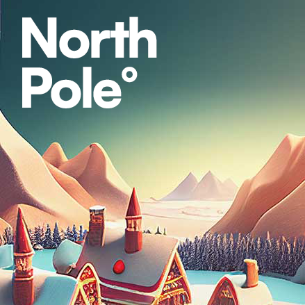
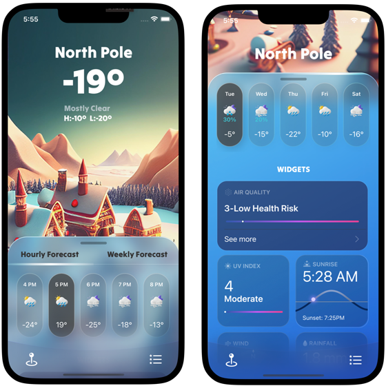

<!-- PROJECT LOGO -->
 

    

  <h3 align="center">NorthPole° iOS App</h3>

  

    A weather app for the North Pole. Built in SwiftUI.
  

<!-- ABOUT THE PROJECT -->

#

## About The Project

#

Project Focus: NorthPole° goal is to implement an app with SwiftUI with navigation and static data. UI and UX is also the focal pedagogical point of the project. The next step is to integrate a weather API to fetch live weather data.

### Built With

<!-- ROADMAP -->

## Roadmap

- [x] Add visual assets and fonts
- [x] Build main navigation with sheets.
- [x] Get static data from structs
- [ ] Fetch dynamic data from weather API
- [ ] Add tests

<!-- CONTACT -->

## Contact

André Foulem - [MyTwitter](https://twitter.com/andreincolors) - [LinkedIn](https://www.linkedin.com/in/andr%C3%A9-foulem-845087244/)
